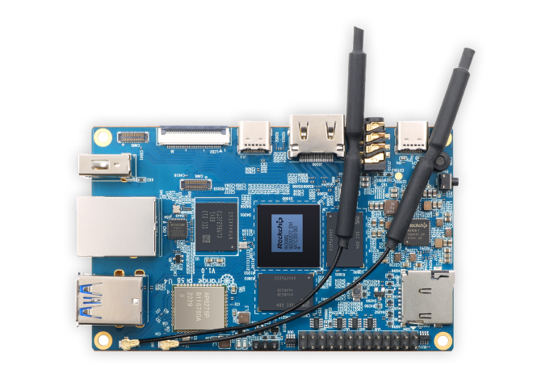

# device_board_orangepi

## 介绍

本仓用于放置orangepi开发板相关内容，各开发板的使用教程和使用详细说明可点击下表开发板名称查看。

| 开发板名称                                       | SoC型号           | 应用领域                                   | 设备互联类型        |
|:-------------------------------------------:|:---------------:|:--------------------------------------:|:-------------:|
| [OrangePi 5B](orangepi_5b/README_zh.md) | `Rockchip RK3588S` | 智能家居、AI人脸识别、工业控制、智慧车载、多媒体处理、AI边缘计算、物联网 | 有线以太网、WIFI、蓝牙 |

#### 开发板简介

- [OrangePi 5B](https://gitee.com/openharmony-dg/device_board_orangepi/blob/master/orangepi_5b/README_zh.md)

OrangePi 5B是一款应用于图像处理，音视频处理和深度学习等场景的智能硬件，其主芯片采用Rockchip RK3588S芯片方案。
RK3588S支持GPU和神经网络加速子系统，支持8K视频编解码器引擎和一流的HDR图像处理，并集成了所有标准音频/视频输入/输出接口。主系统的CPU采用大小核设计，主频高达2.2GHz，集成了四个Cortex-A76核心和两Cortex-A53核心 ，集成独立的5.0T NPU处理器。

#### 开发板架构



## 目录

```
device/board/orangepi
├── orangepi_5b             # OrangePi 5B开发板目录
├── figures                 # 开发板或产品相关图片目录
├── LICENSE
├── OTA.xml
└── README_zh.md
```

## 使用说明

OrangePi 5B参考:

- [OrangePi 5B](https://gitee.com/openharmony-dg/device_board_orangepi/blob/master/orangepi_5b/README_zh.md)

## 相关仓

- device_board_orangepi

- [vendor_orangepi](https://gitee.com/openharmony-dg/vendor_orangepi)

- [device_soc_rockchip](https://gitee.com/openharmony-dg/device_soc_rockchip)

- [kernel](https://gitee.com/openharmony-dg/orangepi_linux_5.10)
